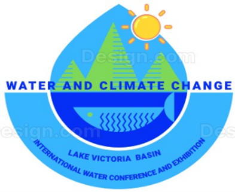

 <br />
# Lake Victoria Basin International Conference and Exhibition (LVBICE) 2026

Official website for the Lake Victoria Basin International Conference and Exhibition (LVBICE) 2026. This platform serves as the digital hub for the conference, providing information about the event, registration details, speakers, and more.

## 📅 Event Details

- **Event**: Lake Victoria Basin International Conference and Exhibition (LVBICE) 2026
- **Theme**: "Harnessing Artificial Intelligence for Sustainable Development in the Lake Victoria Basin"
- **Date**: October 2026
- **Venue**: Acacia Hotel, Kisumu, Kenya

## 🚀 Features

- Modern, responsive design built with Next.js and React 19
- Type-safe development with TypeScript
- Styled with Tailwind CSS and Material-UI components
- Optimized for performance and SEO
- Interactive UI components and animations
- Contact form and registration system
- Information about speakers, schedule, and venue

## 🛠️ Tech Stack

### Core Technologies
- [Next.js 16.0.3](https://nextjs.org/) - The React Framework for Production
- [React 19.2.0](https://reactjs.org/) - A JavaScript library for building user interfaces
- [TypeScript 5](https://www.typescriptlang.org/) - Type-safe JavaScript
- [Tailwind CSS 4](https://tailwindcss.com/) - A utility-first CSS framework
- [Material-UI 7.3.5](https://mui.com/) - React components for faster and easier web development

### Development Tools
- [ESLint](https://eslint.org/) - For code linting
- [Prettier](https://prettier.io/) - For code formatting
- [PostCSS](https://postcss.org/) - For CSS processing
- [Swiper](https://swiperjs.com/) - For touch slider components

## 🚀 Getting Started

### Prerequisites
- Node.js 18.0.0 or later
- npm or yarn package manager

### Installation

1. Clone the repository:
   ```bash
   git clone https://github.com/OJ254/lvbice-website.git
   cd lvbice-website
   ```

2. Install dependencies:
   ```bash
   npm install
   ```

3. Start the development server:
   ```bash
   npm run dev
   # or
   next dev
   ```

4. Open [http://localhost:3000](http://localhost:3000) in your browser to see the result.

## 📁 Project Structure

```
src/
├── app/                    # App router directory
│   └── pages/              # Main pages
│       └── about/          # About page and its sections
├── components/             # Reusable components
│   └── general/            # General components
│       └── Header/         # Header component
├── public/                 # Static files
└── theme/                  # Theme configuration
```

## 🛠️ Available Scripts

- `npm run dev` - Start the development server
- `npm run build` - Build the application for production
- `npm start` - Start the production server
- `npm run lint` - Run ESLint

## 🤝 Contributing

Contributions are welcome! Please follow these steps:

1. Fork the repository
2. Create your feature branch (`git checkout -b feature/AmazingFeature`)
3. Commit your changes (`git commit -m 'Add some AmazingFeature'`)
4. Push to the branch (`git push origin feature/AmazingFeature`)
5. Open a Pull Request

## 📄 License

This project is licensed under the MIT License - see the [LICENSE](LICENSE) file for details.

## 📧 Contact

For more information about the conference, please contact [info@lvbice.com](mailto:info@lvbice.com)